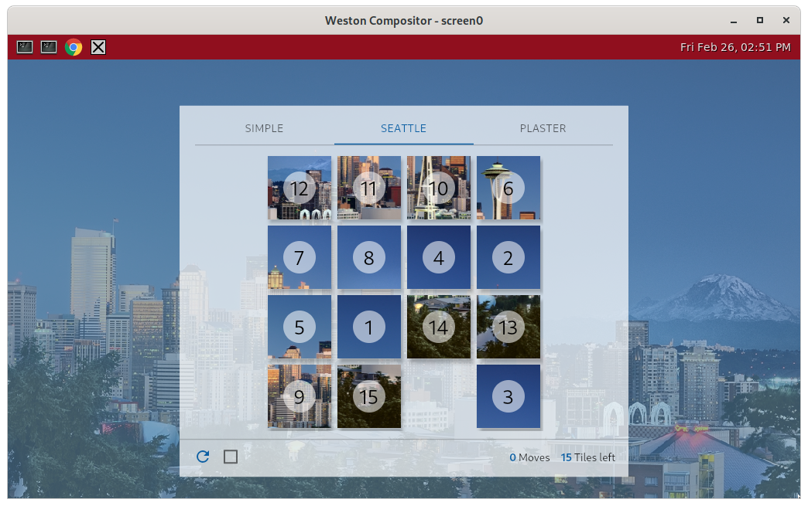

Flutter Wayland
============

A Flutter Embedder/Launcher that talks to Wayland.



Features:
 - Suited for running on [STB](https://en.wikipedia.org/wiki/Set-top_box) or any other embedded devices,
 - Provides only mininum required implementataion for launching Flutter application _(both JIT or AOT modes are supported)_:
  - keyboard support with repetition _(no touch support, only basic pointer events are implemented)_,
  - support the following Wayland extensions:

    -  [presentation-time](https://github.com/wayland-project/wayland-protocols/blob/master/stable/presentation-time/presentation-time.xml) with a fallback to frame callback,

    -  [XWayland keyboard grabbing protocol](https://github.com/wayland-project/wayland-protocols/tree/0a61d3516b10da4e65607a6dd97937ebedf6bcfa/unstable/xwayland-keyboard-grab) assumes [Wayland server](https://gitlab.freedesktop.org/dwrobel/weston/-/commits/dw-master-key-grab-2) implements it
        _(allows to run Flutter application as a main UI which will receive all key events even when not having a focus, which is needed to control other applications)_,

Build dependencies:
-------------------
  - Fedora >=33:
```
dnf install cmake clang extra-cmake-modules pkgconf-pkg-config libxkbcommon-devel wayland-devel wayland-protocols-devel libwayland-client libwayland-egl gtk3-devel
```

- Yocto
 ```
 TOOLCHAIN = "clang"
 DEPENDS = "flutter-engine gtk+3 libxkbcommon wayland-protocols extra-cmake-modules"
 inherit pkgconfig cmake
```

Build instructions:
-------------------

```
# If you don't have pkg-config flutter-engine.pc file
# provide directory location of flutter_embedder.h file:
EMBEDDER_INC=<directory-path-to-compiled-engine>/src/out/linux_release_x64
# directory location of libflutter_engine.so (typically the same as for header files)
FLUTTER_LIBDIR=${EMBEDDER_INC}

# Preferably use the same compiler as was used for compiling the engine:
export CC=clang
export CXX=clang++

mkdir -p build
pushd build

# If you don't have flutter-engine.pc file
cmake .. -DFLUTTER_ENGINE_LIBRARIES=flutter_engine -DFLUTTER_ENGINE_LIBRARY_DIRS=${FLUTTER_LIBDIR} -DFLUTTER_ENGINE_INCLUDE_DIRS=${EMBEDDER_INC}
# otherwise
cmake ..

# Common step to compile sources
cmake --build . -j $(getconf _NPROCESSORS_ONLN) --verbose
popd
```

Direct runtime dependencies:
---------------------
```
$ readelf -d flutter-launcher-wayland  | grep NEEDED | awk '{gsub(/\[|\]/,"",$NF); print "  - "$5}'
  - libdl.so.2
  - libxkbcommon.so.0
  - libEGL.so.1
  - libwayland-client.so.0
  - libwayland-egl.so.1
  - libflutter_engine.so
  - libstdc++.so.6
  - libm.so.6
  - libgcc_s.so.1
  - libc.so.6
```

Running Flutter Applications
----------------------------

```
Usage: `flutter-launcher-wayland <asset_bundle_path> <flutter_flags>`


This utility runs an instance of a Flutter application and renders using
Wayland core protocols.

The Flutter tools can be obtained at https://flutter.io/

asset_bundle_path: The Flutter application code needs to be snapshotted using
                   the Flutter tools and the assets packaged in the appropriate
                   location. This can be done for any Flutter application by
                   running `flutter build bundle` while in the directory of a
                   valid Flutter project. This should package all the code and
                   assets in the "build/flutter_assets" directory. Specify this
                   directory as the first argument to this utility.

    flutter_flags: Typically empty. These extra flags are passed directly to the
                   Flutter engine. To see all supported flags, run
                   `flutter_tester --help` using the test binary included in the
                   Flutter tools.

Supported environment variables:
     LANG=<string>
                   Value encoded as per setlocale(3) (e.g. "szl_PL.utf8") is
                   passed to the engine via UpdateLocales().

                   See also: https://man7.org/linux/man-pages/man3/setlocale.3.html
 
     FLUTTER_WAYLAND_PIXEL_RATIO=<double>
                   Overwrites the pixel aspect ratio reported
                   to the engine by FlutterEngineSendWindowMetricsEvent().

                   See also: https://api.flutter.dev/flutter/dart-ui/Window/devicePixelRatio.html

     FLUTTER_WAYLAND_MAIN_UI=<int>
                   Non-zero value enables grabbing all keys (even without having
                   a focus) using Xwayland keyboard grabbing protocol (assuming 
                   server implement this extension).

                   See also: https://github.com/wayland-project/wayland-protocols/tree/0a61d3516b10da4e65607a6dd97937ebedf6bcfa/unstable/xwayland-keyboard-grab

     FLUTTER_LAUNCHER_WAYLAND_DEBUG=<string>
                   where <string> can be any of syslog(3) prioritynames or its
                   unique abbreviation e.g. "err", "warning", "info" or "debug".

     FLUTTER_LAUNCHER_WAYLAND_CGROUP_MEMORY_PATH=<string>
                   if the app is run inside lxc container - path to where cgroup/memory memory.usage_in_bytes & cgroup.event_control are located
                   necessary for memory watcher to work

     FLUTTER_LAUNCHER_WAYLAND_MEMORY_WARNING_WATERMARK_BYTES=<string>
                   if FLUTTER_LAUNCHER_WAYLAND_CGROUP_MEMORY_PATH is defined, this specifies container memory usage levels at which the application
                   will get FlutterEngineNotifyLowMemoryWarning notifications; the format is comma-separated memory (in bytes) values, like:
                   "1000000,70000000,148478361,167038156,176318054"
                   At least one memory level needs to be defined for memory watcher to work. After each notification, there is 20sec cooldown period,
                   when additional FlutterEngineNotifyLowMemoryWarning notifications will not be called.

```

Contributing:
-------------
 Before submitting a new PR:
 - Format the code with `clang-format -i src/*.*`.
 - Make sure that code compiles fine with both `gcc >=11` and `clang >= 11` _(no single warning on clang)_.
 - Test on PC with both:

   - AddressSanitizer (recompile code with: `-fsanitize=address -fPIE -fno-omit-frame-pointer`),

   - TheadSanitizer (recompile code with: `-fsanitize=thread -fPIE -fno-omit-frame-pointer`).

Authors:
--------
Based on  the original code from: https://github.com/chinmaygarde/flutter_wayland

Heavily rewritten by: Damian Wrobel <<dwrobel@ertelnet.rybnik.pl>>

